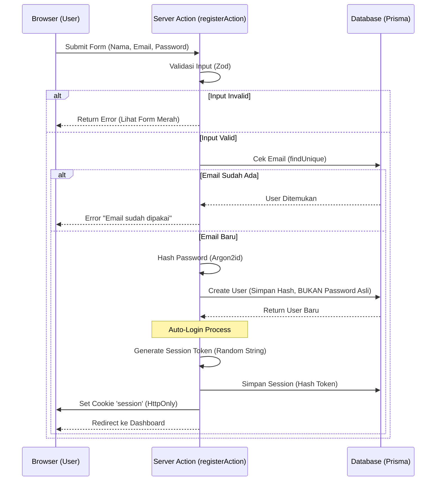
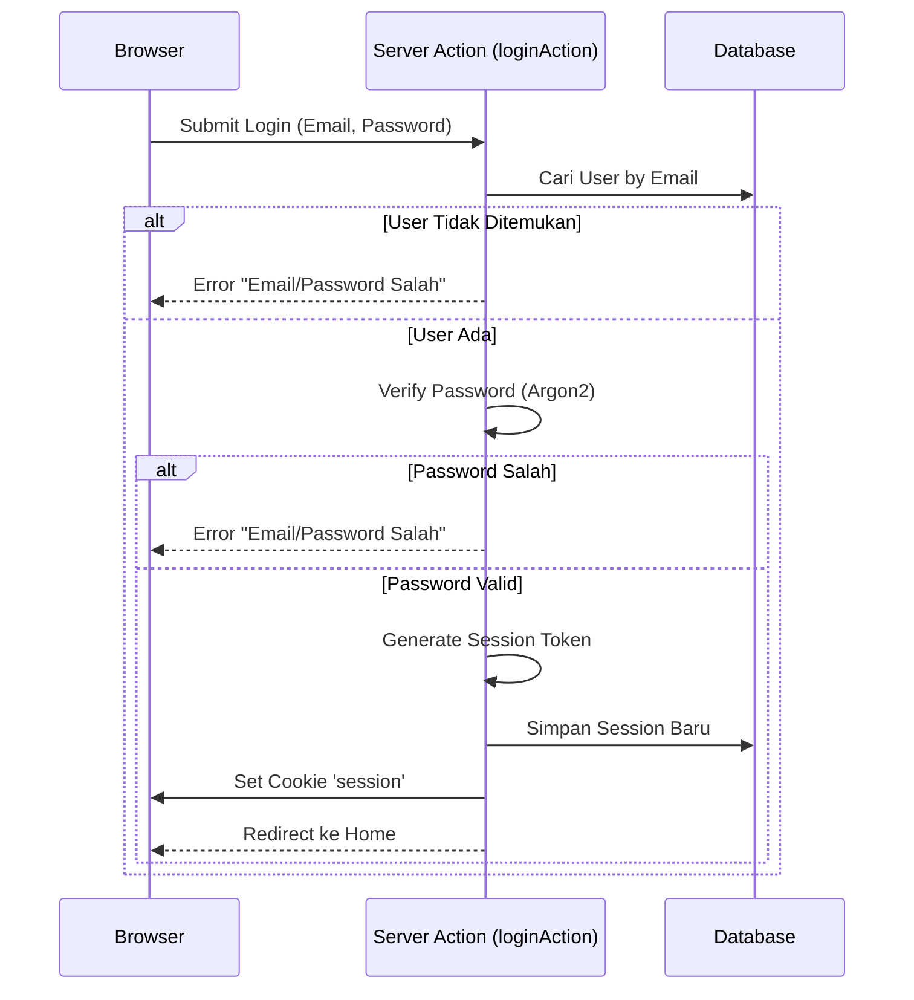
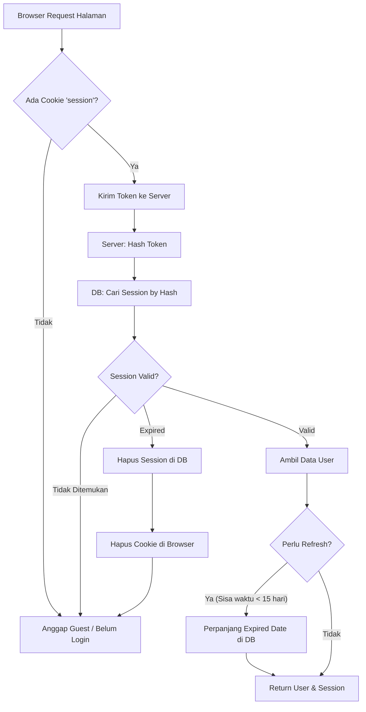

# Panduan Autentikasi Manual (Manual Auth Guide)

Dokumen ini menjelaskan arsitektur sistem autentikasi manual yang kita bangun menggunakan Prisma, Argon2, dan Session Management. Panduan ini dirancang untuk pembelajaran mendalam tentang keamanan web.

## 1. Arsitektur Flow Diagram

Berikut adalah visualisasi bagaimana data mengalir dalam sistem login dan register kita.

### A. Flow Register (Pendaftaran)

Proses user membuat akun baru.

### B. Flow Login (Masuk)

Proses user masuk ke akun yang sudah ada.

### C. Flow Validasi Session (Middleware/Layout)

Proses yang terjadi setiap kali user membuka halaman untuk mengecek "Apakah saya sudah login?".

---

## 2. Komponen Utama & Kode

### 1. Database (Prisma Schema)

- **User Table**:
  - `email`: Unik, untuk identitas.
  - `password`: Tipe String, tapi isinya adalah **HASH** (bukan teks asli).
- **Session Table**:
  - `id`: Primary key, isinya adalah hash dari session token.
  - `userId`: Foreign key ke User.
  - `expiresAt`: Kapan sesi mati otomatis.

### 2. Utilities (`lib/auth.ts`)

- **`hashPassword(password)`**: Mengubah "rahasia123" menjadi `$argon2id$v=19$m=19456...`. Ini satu arah (tidak bisa dikembalikan).
- **`verifyPassword(hash, password)`**: Menguji apakah password yang dimasukkan user cocok dengan hash di database.
- **`createSession(userId)`**: Membuat tiket masuk (session) baru.
- **`validateSessionToken(token)`**: Mengecek tiket user, apakah asli atau palsu/kadaluwarsa.

### 3. Server Actions (`app/actions/auth.ts`)

- Pintu gerbang logic aplikasi. Frontend tidak boleh akses database langsung, harus lewat sini.
- Menggunakan `zod` untuk memastikan data yang dikirim user bersih dan aman.

---

## 3. Security Best Practices (Keamanan)

Kenapa kita melakukan cara "ribet" ini? Demi keamanan.

1.  **HttpOnly Cookie**:
    Cookie session kita set `HttpOnly`. Artinya, hacker yang berhasil menyusupkan script jahat (XSS) di website kita **TIDAK BISA** membaca cookie ini via JavaScript `document.cookie`. Session user aman.

2.  **Session Hashing**:
    Kita tidak menyimpan token sesi mentah di database. Kita simpan HASH-nya (SHA256).
    _Skenario_: Jika database kita bocor dicuri hacker, mereka dapat daftar session ID. Tapi mereka **tidak bisa** menggunakan ID itu untuk login karena browser butuh token ASLI (yang belum di-hash), dan token asli cuma ada di cookie user masing-masing.

3.  **Argon2 Hashing**:
    Algoritma hashing modern yang didesain "lambat" dan memakan memori (Memory Hard). Ini membuat hacker sangat sulit dan mahal untuk mencoba menebak password dengan Bruteforce Attack menggunakan GPU canggih.

4.  **Zod Validasi**:
    Mencegah user iseng mengirim data aneh (SQL Injection dasar atau input sampah) sebelum data itu menyentuh logic database kita.

---

## 4. Cara Debugging

Jika login gagal atau error, lakukan langkah ini:

1.  **Cek Database (Table Users)**:
    - Apakah user baru masuk?
    - Lihat kolom password. Isinya harus panjang dan acak (hash), bukan teks biasa.
2.  **Cek Database (Table Sessions)**:
    - Login -> Harus muncul baris baru.
    - Logout -> Baris itu harus hilang.
3.  **Cek Browser (Developer Tools -> Application -> Cookies)**:
    - Apakah ada cookie bernama `session`?
    - Apakah domain dan path-nya benar?
4.  **Console Server**:
    - Lihat terminal VS Code tempat `npm run dev` jalan. Error detail biasanya muncul di sana (karena kita pakai `console.error` di `catch` block).
